# 📚 Library Membership Management System

**Student:** Aman Esenaliev  
**Course:** OOP Final Project  
**Language:** Java 17+  
**Presentation:** https://docs.google.com/presentation/d/1MLRzX9utMGRmEaGXAVCMr3CGOHJdIRTn/edit?usp=sharing&ouid=113198268765850029873&rtpof=true&sd=true  
**GitHub:** https://github.com/hxmanya/LibMembershipManager

---

## Description

The Library Membership Management System is a Java application for managing library member records. It supports two interface modes: a full **Graphical User Interface (GUI)** built with Swing, and a **Command Line Interface (CLI)** for terminal-based usage. All data is stored in an SQLite database, with CSV export/import support for data portability.

---

## Objectives

- Build a complete CRUD system for managing library memberships
- Demonstrate all three OOP principles: Encapsulation, Inheritance, and Polymorphism
- Implement role-based access control (Admin vs User)
- Provide both GUI and CLI interfaces for flexibility
- Persist data using SQLite with CSV backup/import capability

---

## Project Requirements

| # | Requirement | Status |
|---|-------------|--------|
| 1 | **CRUD Operations** — Create, Read, Update, Delete member records | ✅ |
| 2 | **Command Line Interface** — Clear menus and prompts in terminal mode | ✅ |
| 3 | **Graphical User Interface** — Swing-based GUI with table view and sidebar | ✅ |
| 4 | **Input Validation** — Email, phone, and ID format validation via `Validator` | ✅ |
| 5 | **Data Persistence** — SQLite database via JDBC (`DatabaseManager`) | ✅ |
| 6 | **File Export/Import** — CSV export and import via `FileManager` | ✅ |
| 7 | **Authentication** — Login system with SHA-256 password hashing | ✅ |
| 8 | **User Roles** — Admin (full access) and User (read-only) roles | ✅ |
| 9 | **Encapsulation** — Private fields with getters/setters in all model classes | ✅ |
| 10 | **Inheritance** — `Person` (abstract) → `Member`, `Staff` child classes | ✅ |
| 11 | **Polymorphism** — `getDisplayInfo()` overridden differently in `Member` and `Staff` | ✅ |
| 12 | **Error Handling** — Try/catch blocks, validation messages, graceful failures | ✅ |

---

## Project Structure

```
src/
├── Main.java                   # Entry point — launches GUI or CLI
│
├── model/
│   ├── Person.java             # Abstract base class (Inheritance root)
│   ├── Member.java             # Child of Person — library member
│   ├── Staff.java              # Child of Person — staff member
│   ├── MembershipType.java     # Enum: BASIC, STANDARD, PREMIUM
│   ├── MembershipStatus.java   # Enum: ACTIVE, EXPIRED, CANCELLED
│   ├── UserAccount.java        # Login account model
│   └── Role.java               # Enum: ADMIN, USER
│
├── service/
│   ├── MembershipService.java  # Business logic for all member operations
│   └── AuthService.java        # Authentication — login, logout, role check
│
├── ui/
│   ├── MainWindow.java         # Swing GUI — main window with table and sidebar
│   ├── LoginDialog.java        # Swing login dialog
│   ├── MemberFormDialog.java   # Swing form for add/edit member
│   └── ConsoleUI.java          # CLI — text-based menu system
│
└── util/
    ├── DatabaseManager.java    # SQLite CRUD operations via JDBC
    ├── FileManager.java        # CSV read/write for export and import
    └── Validator.java          # Input validation (email, phone, ID)

data/
├── library.db                  # SQLite database (auto-created)
└── users.csv                   # User accounts (auto-created)
```

---

## OOP Principles Demonstrated

### Encapsulation
All model classes (`Member`, `Staff`, `UserAccount`) use **private fields** with public getters and setters. For example, `Member.id`, `Member.email`, `Member.status` are private and only accessible through controlled methods.

### Inheritance
`Person` is an **abstract parent class** holding common fields (`id`, `name`, `email`, `phone`). Both `Member` and `Staff` extend `Person`, inheriting its fields and implementing the abstract method `getDisplayInfo()`.

```
Person (abstract)
├── Member   — adds membershipType, status, joinDate, expiryDate
└── Staff    — adds role, department
```

### Polymorphism
`getDisplayInfo()` is declared abstract in `Person` and **overridden** in each subclass to produce different output formats. When `toString()` is called on any `Person` reference, the correct subclass version executes at runtime.

---

## Features

### Member Management
- **Register** a new member with ID, name, email, phone, membership type, and duration
- **View** all members in a table (GUI) or list (CLI)
- **Search** by ID, name, or filter by status (ACTIVE / EXPIRED / CANCELLED)
- **Edit** member details (name, email, phone, membership type)
- **Renew** membership — extends from current expiry date
- **Reactivate** a cancelled membership — starts fresh from today with new type
- **Cancel** membership — marks as CANCELLED
- **Delete** member record permanently

### Data
- **Export to CSV** — saves all members to a file
- **Import from CSV** — loads members, skipping duplicates
- **Statistics** — count of ACTIVE, EXPIRED, CANCELLED members and total

### Security
- Login required before any access
- Passwords hashed with **SHA-256**
- Admin role required for all write operations; User role is read-only

---

## Default Accounts

| Username | Password | Role |
|----------|----------|------|
| `admin` | `admin123` | ADMIN |
| `librarian` | `lib123` | USER |

Accounts are auto-created on first run if `data/users.csv` does not exist.

---

## Running the Application

### Prerequisites
- Java 17+
- Maven (for dependency management)
- SQLite JDBC driver (included via `pom.xml`)

### GUI Mode (default)
```bash
mvn compile
mvn exec:java -Dexec.mainClass="Main"
```

### CLI Mode
```bash
mvn exec:java -Dexec.mainClass="Main" -Dexec.args="--cli"
```

---

## Membership Types

| Type | Annual Fee | Borrow Limit |
|------|-----------|--------------|
| BASIC | $30 | 1 book |
| STANDARD | $60 | 3 books |
| PREMIUM | $100 | 6 books |

---

## Data Persistence

- Primary storage: **SQLite** (`data/library.db`) — all CRUD operations go through `DatabaseManager` using JDBC prepared statements.
- Export/Import: **CSV** files via `FileManager` — useful for backup and bulk loading.
- User accounts: stored in `data/users.csv` with SHA-256 hashed passwords.

---

## Error Handling

- Invalid input is caught at the UI layer before reaching service logic
- Database errors throw `RuntimeException` with descriptive messages
- Import skips duplicate IDs instead of failing entirely
- All dialogs (GUI) and warnings (CLI) show clear user-facing messages

---

## Test Cases

| Action | Input | Expected Output |
|--------|-------|-----------------|
| Register member | ID: `M001`, valid email/phone | Member created, shown in table/list |
| Register duplicate | ID: `M001` again | Error: "Member ID already exists" |
| Search by name | "ali" | All members with "ali" in name |
| Renew membership | ID: `M001`, 6 months | Expiry extended 6 months from current expiry |
| Reactivate | CANCELLED member, 12 months | Expiry set to today + 12 months |
| Login wrong password | any username, wrong pass | "Invalid credentials" error |
| User tries to delete | logged in as `librarian` | "Access denied. Admin role required." |
| Export CSV | valid file path | CSV file created with all members |
| Import CSV | valid file path | New members added, duplicates skipped |

---

## Screenshots

> All screenshots were taken with system date and time visible in the taskbar.

### 1. Login Screen
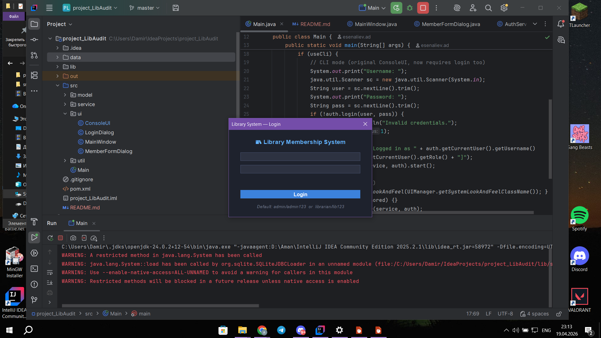

*Login dialog — user enters credentials before accessing the system.*

---

### 2. Main Window — Member Table
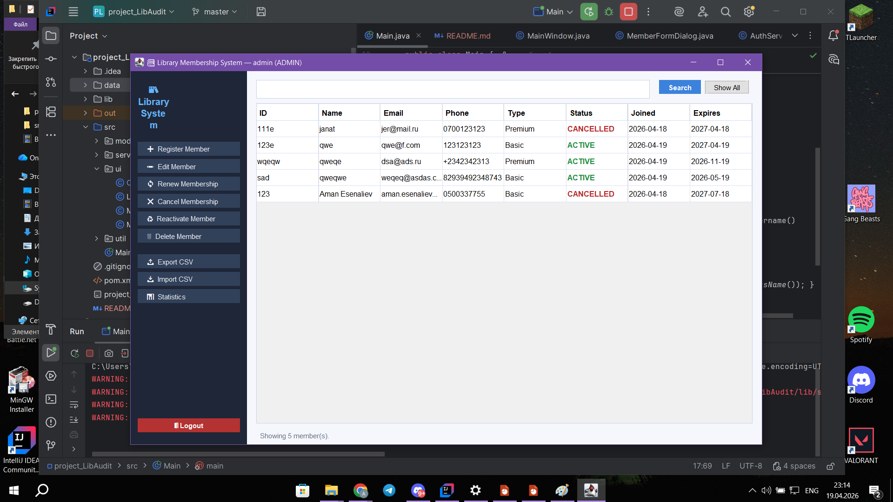

*Main GUI window showing all registered members in the table with sidebar navigation.*

---

### 3. Register New Member
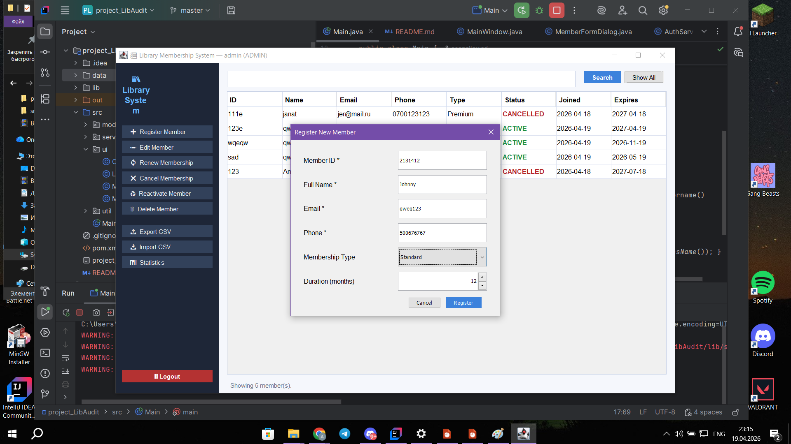

*MemberFormDialog — filling in ID, name, email, phone, membership type and duration.*

---

### 4. Validation Error
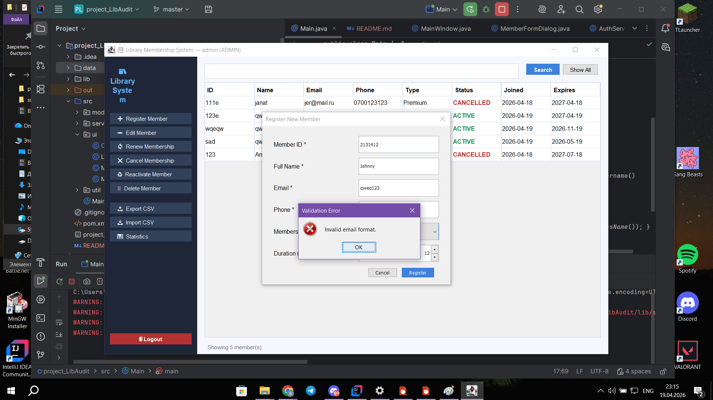

*Error message shown when an invalid email or phone format is entered.*

---

### 5. Search by Name
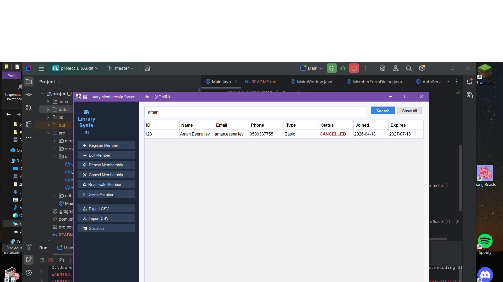

*Live search — filtering members by name in the search bar.*

---

### 6. Edit Member
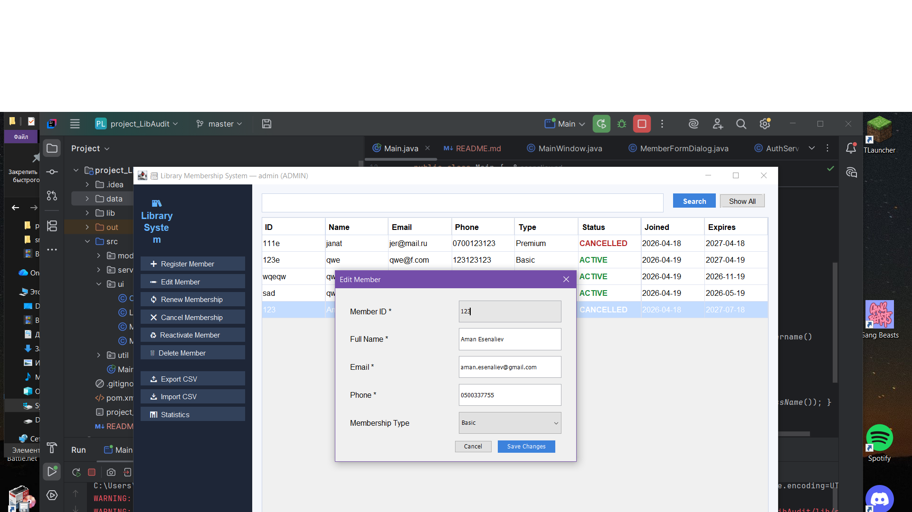

*Edit dialog — modifying an existing member's details.*

---

### 7. Renew Membership
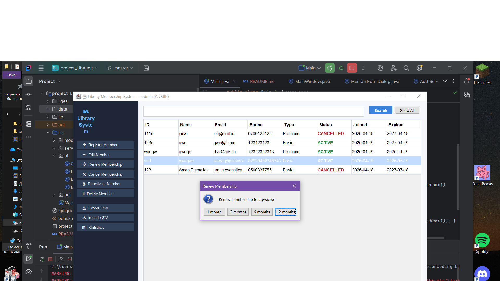

*Renew dialog — selecting duration to extend membership from current expiry date.*

---

### 8. Cancel Membership
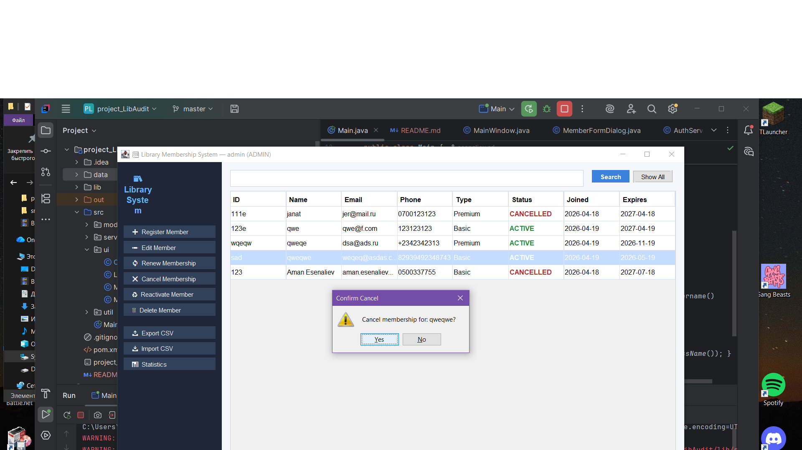

*Confirmation dialog before cancelling a membership.*

---

### 9. Reactivate Membership
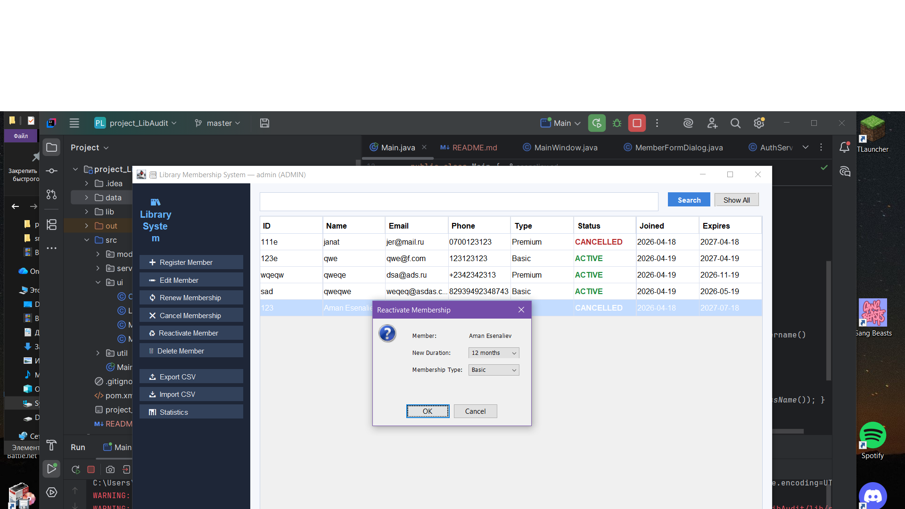

*Reactivate dialog — selecting new type and duration, starts fresh from today.*

---

### 10. Delete Member
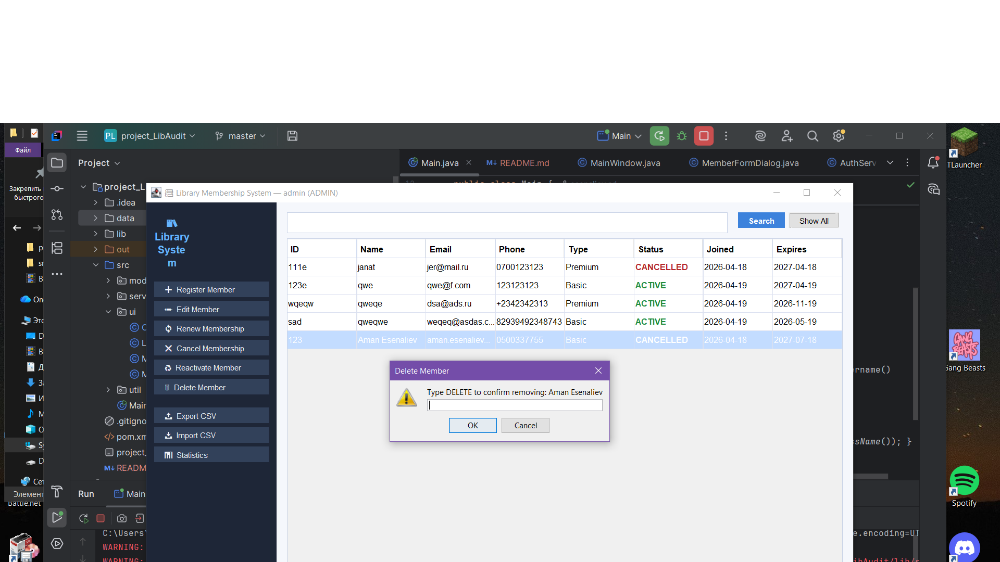

*Delete confirmation — user must type DELETE to confirm permanent removal.*

---

### 11. Statistics
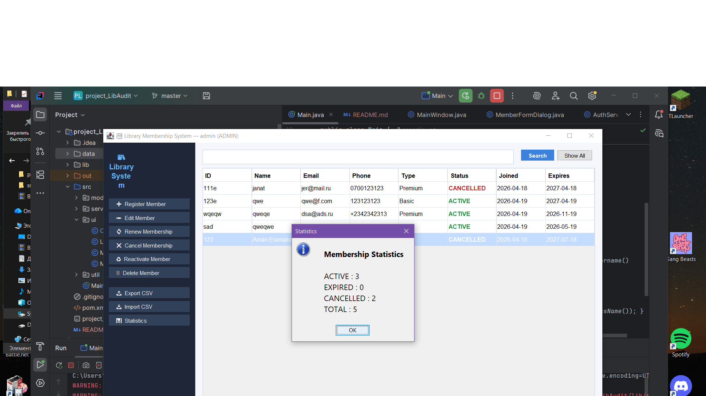

*Statistics popup showing count of ACTIVE, EXPIRED, CANCELLED members and total.*

---

### 12. Export CSV
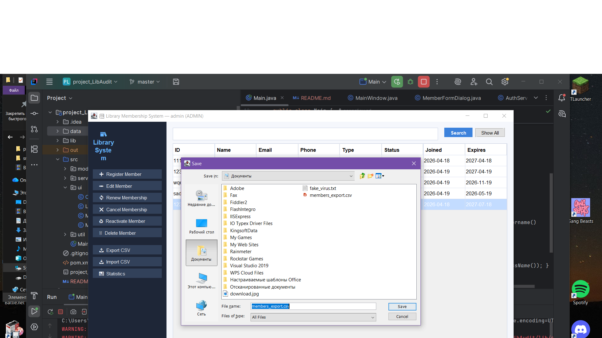

*File chooser dialog for exporting all members to a CSV file.*

---

### 13. Import CSV
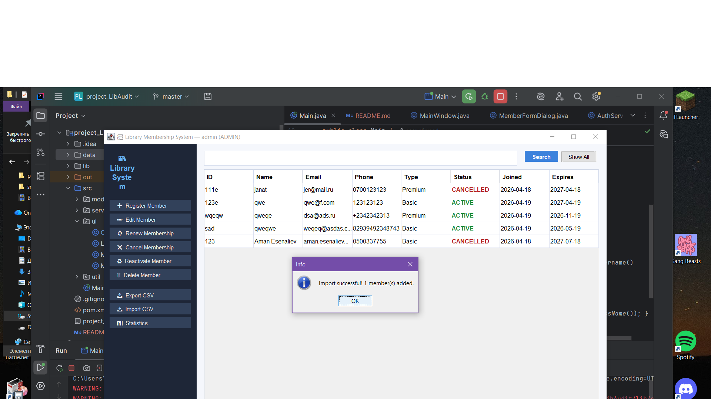

*Success message after importing members from a CSV file.*

---

### 14. Access Denied (User Role)
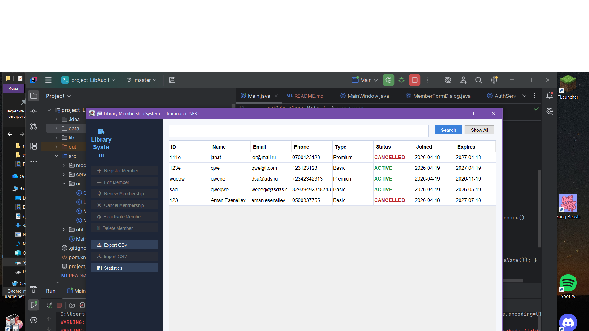

*Librarian account (USER role) attempting a write operation — access denied message.*

---

### 15. CLI Mode — Main Menu
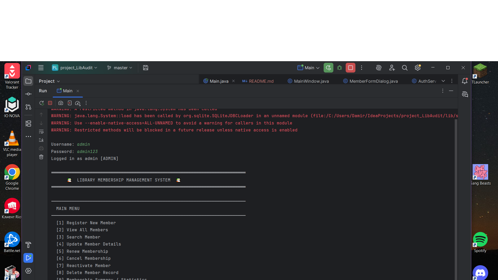

*Command Line Interface showing the main menu after login.*

---

### 16. Data Files
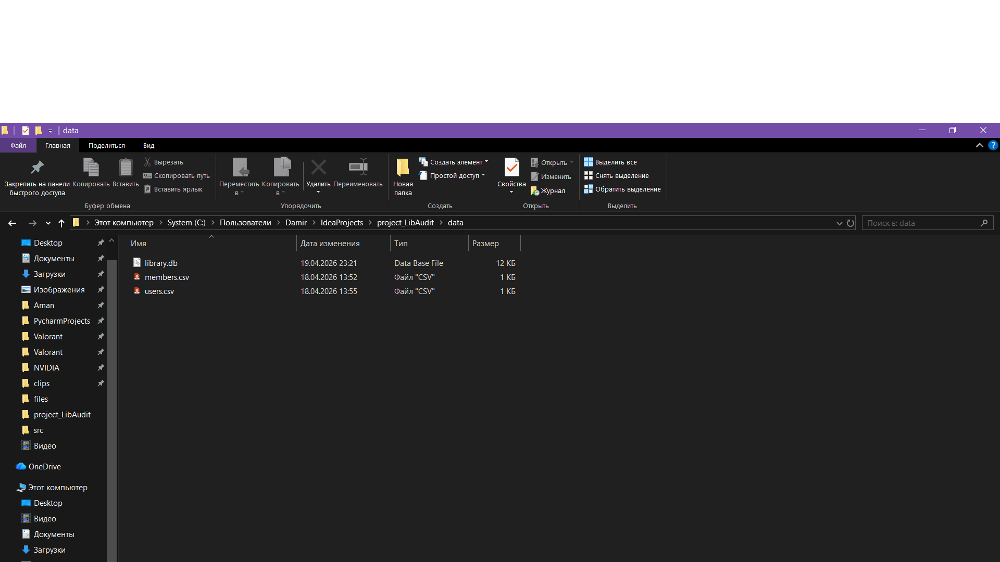

*File explorer showing `data/library.db` and `data/users.csv` created by the application.*
